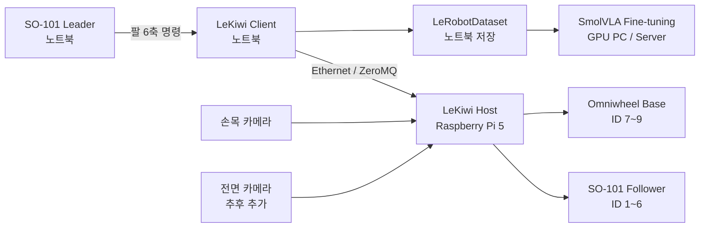

# SO-101 + LeKiwi Mobile Manipulation

SO-101 Leader/Follower와 LeKiwi를 결합한 모바일 매니퓰레이션 프로젝트

목표: LeKiwi로 물체까지 이동 → SO-101 팔로 물체 파지 → 오른쪽에 배치

> Drive to the object, pick it up, and place it to the right.

Leader arm으로 Follower arm과 LeKiwi 베이스를 텔레오퍼레이션하고, 카메라와
9차원 action/state를 하나의 LeRobotDataset으로 기록. 수집한 통합 에피소드로
ACT를 먼저 거치지 않고 `lerobot/smolvla_base`를 직접 파인튜닝하는 것이 최종
목표

## 프로젝트 목표

- SO-101 Leader를 이용한 Follower 6축 텔레오퍼레이션
- LeKiwi 옴니휠 베이스의 전후·좌우·회전 제어
- 손목 카메라와 전면 카메라를 이용한 시각 관측
- 팔 6축과 베이스 3축을 합친 공식 LeKiwi 9차원 action/state 유지
- 자연어 작업 문장이 포함된 LeRobotDataset 수집 및 검증
- 50개 이상의 고품질 통합 에피소드 확보
- `lerobot/smolvla_base` 파인튜닝과 실제 로봇 평가

최초 10개 에피소드는 학습 성능보다 데이터 구조, 영상, 타임스탬프와
observation/action 정합성 검증에 사용

## 전체 시스템



| 장치 | 역할 |
| --- | --- |
| Raspberry Pi 5 | LeKiwi 바퀴, Follower arm, 카메라, LeKiwi host |
| 노트북 | Leader arm, LeKiwi client, 데이터 저장 |
| GPU PC 또는 연구실 서버 | SmolVLA 파인튜닝과 평가 |

### Ethernet

노트북과 Raspberry Pi Ethernet 직접 연결

```text
노트북 Ethernet    10.42.0.1
Raspberry Pi eth0  10.42.0.2/24
SSH                 ssh moai5@10.42.0.2
Pi hostname         lekiwi
```

연결 확인:

```bash
ping -c 3 10.42.0.2
ssh moai5@10.42.0.2
```

노트북은 NetworkManager의 `Wired connection 1` shared 방식, Pi는
`systemd-networkd`와 `/etc/netplan/99-lekiwi-lan.yaml` 사용

## Action / State 설계

최종 데이터셋은 공식 LeKiwi의 9차원 구조를 기준으로 구성

| 차원 | 항목 | 단위 |
| ---: | --- | --- |
| 1 | `shoulder_pan` | degree |
| 2 | `shoulder_lift` | degree |
| 3 | `elbow_flex` | degree |
| 4 | `wrist_flex` | degree |
| 5 | `wrist_roll` | degree |
| 6 | `gripper` | percent |
| 7 | `x.vel` | m/s |
| 8 | `y.vel` | m/s |
| 9 | `theta.vel` | deg/s |

관측 데이터:

- 손목 카메라 `observation.images.wrist`
- 전면 카메라 observation — 전원과 카메라 선정 후 추가 예정
- SO-101 Follower 관절 state 6축
- LeKiwi 베이스 velocity state 3축
- 자연어 작업 문장

action과 state의 x축은 반드시 같은 기준 사용. 현재 실제 장착 방향에 맞도록
두 x축을 함께 반전한 패치 적용 완료

## 현재 진행 상태

### 완료

- SO-101 Follower 모터 ID 1~6 확인
- SO-101 Leader/Follower 캘리브레이션과 공통 시작 자세 구성
- Leader 입력 기반 6축 텔레오퍼레이션 검증
- 손목 카메라 파일럿 에피소드 기록 검증
- LeKiwi 모터 ID 1~9, model 777, ping 정상 확인
- LeKiwi calibration과 실제 모터 설정의 정합성 확인
- 노트북–Pi 고정 Ethernet 연결 구성
- LeKiwi 물리적 앞 방향과 action/state x축 정렬
- Pi host와 노트북 client 기반 키보드 주행 검증

### 다음 작업

1. Innomaker 손목 카메라 한 대의 Pi 연결과 전력 상태 확인
2. 안정적인 `/dev/v4l/by-id` 경로, 포맷, 해상도와 FPS 확인
3. 손목 카메라를 포함한 LeKiwi host/client 텔레오퍼레이션
4. SO-101 Leader arm과 LeKiwi 베이스 동시 제어
5. 공식 9차원 action/state와 카메라 observation 정합성 검증
6. 최초 10개 통합 검증 에피소드 수집
7. 전면 카메라 추가 후 50개 이상의 고품질 에피소드 수집
8. `lerobot/smolvla_base` 파인튜닝과 실제 로봇 평가

## 저장소 구성

```text
so101-follower-guide/
├── README.md                     # 프로젝트 개요와 전체 진행 흐름
├── FOLLOWER_SETUP.md             # Follower 연결과 캘리브레이션
├── LEADER_CONTROL.md             # Leader/Follower 텔레오퍼레이션
├── GAMEPAD_CONTROL.md            # IK 기반 게임패드 제어 실험
├── LEKIWI_KEYBOARD_DRIVE.md      # LeKiwi WASD 주행
├── DATA_COLLECTION.md            # 카메라와 파일럿 데이터 기록
├── NEXT_SESSION_PROMPT.md        # 장치 상태와 다음 세션 인수인계
├── config/                       # 검증된 홈 자세와 정렬 설정
├── patches/                      # LeRobot 복구 패치
└── scripts/                      # 점검, 제어와 기록 스크립트 및 설명서
```

## 문서 안내

| 문서 | 내용 |
| --- | --- |
| [Follower 설정](FOLLOWER_SETUP.md) | USB 권한, 모터 ID, 캘리브레이션과 홈 자세 |
| [Leader/Follower 제어](LEADER_CONTROL.md) | 두 팔 정렬, 단계별 시험과 6축 텔레오퍼레이션 |
| [게임패드 제어](GAMEPAD_CONTROL.md) | IK 기반 Follower 제어와 모터 튜닝 기록 |
| [LeKiwi 키보드 주행](LEKIWI_KEYBOARD_DRIVE.md) | Pi host, 노트북 client와 WASD 주행 |
| [데이터 수집](DATA_COLLECTION.md) | 손목 카메라 점검과 파일럿 에피소드 기록 |
| [스크립트 전체 설명](scripts/README.md) | 27개 스크립트의 용도와 실행 예시 |
| [다음 세션 인수인계](NEXT_SESSION_PROMPT.md) | 검증된 환경, 장치 상태와 다음 작업 시작점 |

## 스크립트 한눈에 보기

VS Code의 `scripts/` 폴더에 있는 실행 파일 전체 목록. 파일명을 누르면 GitHub에서
원본 코드 확인 가능

모든 노트북 명령의 기본 실행 위치:

```bash
conda activate lerobot
cd ~/so101-follower-guide
```

### 모터 및 캘리브레이션 점검

| 파일 | 실행 | 용도 |
| --- | --- | --- |
| [`scan_motor_ids.py`](scripts/scan_motor_ids.py) | `python scripts/scan_motor_ids.py --port /dev/ttyACM0` | SO-101 Feetech ID 1~20 ping |
| [`scan_lekiwi_motor_ids.py`](scripts/scan_lekiwi_motor_ids.py) | `python -u scripts/scan_lekiwi_motor_ids.py` | LeKiwi 팔·바퀴 ID 1~9 ping |
| [`read_raw_positions.py`](scripts/read_raw_positions.py) | `python scripts/read_raw_positions.py --port /dev/ttyACM0` | Raw encoder와 torque 상태 출력 |
| [`read_calibrated_positions.py`](scripts/read_calibrated_positions.py) | `python scripts/read_calibrated_positions.py` | LeRobot 보정 좌표를 degree/percent로 출력 |
| [`check_lekiwi_calibration_match.py`](scripts/check_lekiwi_calibration_match.py) | `python scripts/check_lekiwi_calibration_match.py` | Calibration 파일과 모터 레지스터 비교 |
| [`inspect_motor_tuning.py`](scripts/inspect_motor_tuning.py) | `python scripts/inspect_motor_tuning.py` | Acceleration, velocity와 PID 값 출력 |

Pi에 복사된 LeKiwi ID 스캔 스크립트 실행:

```bash
python -u ~/scan_lekiwi_motor_ids.py
```

정상 LeKiwi 응답: ID 1~9, model 777, ping OK

### 홈 자세 기록과 이동

| 파일 | 실행 | 용도 |
| --- | --- | --- |
| [`capture_follower_home_candidate.py`](scripts/capture_follower_home_candidate.py) | `python scripts/capture_follower_home_candidate.py --port /dev/ttyACM0` | 현재 Follower 자세를 홈 후보 JSON으로 저장 |
| [`capture_leader_home_candidate.py`](scripts/capture_leader_home_candidate.py) | `python scripts/capture_leader_home_candidate.py --port /dev/ttyACM1 --overwrite` | 현재 Leader 자세를 홈 후보 JSON으로 저장 |
| [`move_to_home_candidate.py`](scripts/move_to_home_candidate.py) | `python scripts/move_to_home_candidate.py --port /dev/ttyACM0` | Follower를 저장된 홈으로 저속 이동 |
| [`move_leader_to_home_candidate.py`](scripts/move_leader_to_home_candidate.py) | `python scripts/move_leader_to_home_candidate.py --port /dev/ttyACM1` | Leader를 저장된 홈으로 저속 이동 |
| [`move_both_to_home_candidates.py`](scripts/move_both_to_home_candidates.py) | `python scripts/move_both_to_home_candidates.py` | Leader와 Follower를 각 홈으로 동시 이동 |

홈 이동 스크립트는 현재 위치를 첫 Goal Position으로 기록한 뒤 torque 활성화.
마지막 Enter 입력 시 torque 해제되므로 팔을 받을 준비 필요

### FK, IK와 게임패드 dry-run

| 파일 | 실행 | 용도 |
| --- | --- | --- |
| [`fk_home_candidate.py`](scripts/fk_home_candidate.py) | `python scripts/fk_home_candidate.py` | 저장된 홈 자세의 gripper FK 계산 |
| [`ik_small_steps_dry_run.py`](scripts/ik_small_steps_dry_run.py) | `python scripts/ik_small_steps_dry_run.py` | 각 방향 2 mm 이동의 IK 해 검증 |
| [`inspect_gamepad_axes.py`](scripts/inspect_gamepad_axes.py) | `python scripts/inspect_gamepad_axes.py` | 15초 동안 게임패드 전체 axis 출력 |
| [`gamepad_input_monitor.py`](scripts/gamepad_input_monitor.py) | `python scripts/gamepad_input_monitor.py` | DualShock 4 제어 매핑 모니터링 |
| [`gamepad_ik_dry_run.py`](scripts/gamepad_ik_dry_run.py) | `python scripts/gamepad_ik_dry_run.py` | 게임패드 입력부터 IK까지 모터 없이 검증 |

### Leader/Follower 제어

| 파일 | 실행 | 용도 |
| --- | --- | --- |
| [`leader_input_dry_run.py`](scripts/leader_input_dry_run.py) | `python scripts/leader_input_dry_run.py --port /dev/ttyACM1` | Follower 없이 Leader 보정 입력 출력 |
| [`leader_single_joint_test.py`](scripts/leader_single_joint_test.py) | `python scripts/leader_single_joint_test.py --joint shoulder_pan` | 선택한 한 관절의 제한된 추종 시험 |
| [`leader_body_3joint_test.py`](scripts/leader_body_3joint_test.py) | `python scripts/leader_body_3joint_test.py --mode body` | 몸통 3축 또는 전체 6축 추종 구현 |
| [`leader_teleoperation.py`](scripts/leader_teleoperation.py) | `python scripts/leader_teleoperation.py --leader-port /dev/ttyACM1 --follower-port /dev/ttyACM0` | 최종 6축 텔레오퍼레이션 진입점 |
| [`gamepad_forward_back_test.py`](scripts/gamepad_forward_back_test.py) | `python scripts/gamepad_forward_back_test.py` | 게임패드 기반 XYZ·손목·gripper 제어 |

`leader_teleoperation.py`는 내부에서 `leader_body_3joint_test.py --mode teleop`을
실행하는 짧은 진입점. 데이터 기록 옵션도 그대로 전달 가능

```bash
python scripts/leader_teleoperation.py \
  --leader-port /dev/ttyACM1 \
  --follower-port /dev/ttyACM0 \
  --record-one-episode \
  --episode-seconds 20 \
  --task "Pick up the object and place it to the right."
```

### LeKiwi host와 베이스 제어

| 파일 | 실행 | 용도 |
| --- | --- | --- |
| [`start_lekiwi_host_no_cameras.sh`](scripts/start_lekiwi_host_no_cameras.sh) | `bash ~/start_lekiwi_host_no_cameras.sh 600` | Pi에서 카메라 없는 LeKiwi host 실행 |
| [`lekiwi_forward_pulse_test.py`](scripts/lekiwi_forward_pulse_test.py) | `python scripts/lekiwi_forward_pulse_test.py --speed 0.02 --duration 0.3` | 짧은 저속 전진 pulse 시험 |
| [`lekiwi_cardinal_pulse_test.py`](scripts/lekiwi_cardinal_pulse_test.py) | `python scripts/lekiwi_cardinal_pulse_test.py --speed 0.02 --duration 0.3` | 전후좌우 짧은 pulse 시험 |
| [`lekiwi_keyboard_drive.py`](scripts/lekiwi_keyboard_drive.py) | `python scripts/lekiwi_keyboard_drive.py` | ZMQ 기반 dead-man WASD 주행 |

Pulse와 keyboard client 실행 전 Pi host 필요. 기본 Pi 주소 `10.42.0.2`

### 카메라와 데이터

| 파일 | 실행 | 용도 |
| --- | --- | --- |
| [`test_wrist_camera.py`](scripts/test_wrist_camera.py) | `python scripts/test_wrist_camera.py` | Innomaker 카메라 720p MJPG 스트림과 FPS 확인 |

카메라 점검은 모터 포트를 열지 않음. 파일럿 데이터 기록은
`leader_teleoperation.py --record-one-episode` 사용

### 모터 설정 변경

| 파일 | 실행 | 용도 |
| --- | --- | --- |
| [`set_motor_acceleration.py`](scripts/set_motor_acceleration.py) | `python scripts/set_motor_acceleration.py` | 몸통·손목 acceleration 50, gripper 20 적용 |

`set_motor_acceleration.py`는 유일한 모터 레지스터 변경 도구. 일반 점검 과정에서
실행 금지. 현재 장치에서 가속도 변경에 따른 진동 개선은 거의 없었음

각 스크립트의 옵션, 예상 동작, 종료 방법과 상세 주의사항:
[Scripts Reference](scripts/README.md)

## 실행 환경

### 노트북

```text
OS               Ubuntu
Conda env        lerobot
Python           3.12.13
LeRobot          0.6.2
Leader port      /dev/ttyACM1
Follower port    /dev/ttyACM0  # Pi로 이동하기 전 구성
Project          ~/so101-follower-guide
LeRobot source   ~/lerobot
```

### Raspberry Pi

```text
Board            Raspberry Pi 5
OS               Ubuntu Server 24.04
Conda env        lerobot
Python           /home/moai5/miniforge3/envs/lerobot/bin/python
LeRobot source   /home/moai5/lerobot
LeRobot          0.6.2
ZeroMQ           27.2.0
```

안정적인 Feetech 장치 경로:

```text
/dev/serial/by-id/usb-1a86_USB_Single_Serial_5AAF263511-if00
```

모터 구성:

```text
ID 1  shoulder_pan
ID 2  shoulder_lift
ID 3  elbow_flex
ID 4  wrist_flex
ID 5  wrist_roll
ID 6  gripper
ID 7  wheel
ID 8  wheel
ID 9  wheel
```

## 빠른 시작

아래 명령은 이미 설정과 캘리브레이션을 완료한 현재 장치 기준. 처음 연결하거나
상태가 달라졌다면 각 상세 문서의 읽기 전용 점검부터 진행

### SO-101 Leader/Follower 텔레오퍼레이션

실행 전 두 팔의 포트, 자세와 토크 상태 확인

```bash
conda activate lerobot
cd ~/so101-follower-guide
python scripts/leader_teleoperation.py \
  --leader-port /dev/ttyACM1 \
  --follower-port /dev/ttyACM0
```

예상 동작: Leader의 몸통 3축, 손목 2축과 그리퍼를 Follower가 추종

종료: `Ctrl+C`. Follower 토크 해제에 대비해 팔을 받을 준비

### LeKiwi 키보드 주행

1. Raspberry Pi에서 host 실행

```bash
conda activate lerobot
bash ~/start_lekiwi_host_no_cameras.sh 600
```

`600`은 시작 지연이 아니라 host 최대 실행 시간. Pi 터미널은 계속 유지.
`No command available`은 client 명령을 기다리는 정상 경고

2. 노트북의 새 터미널에서 client 실행

```bash
conda activate lerobot
python ~/so101-follower-guide/scripts/lekiwi_keyboard_drive.py
```

| 입력 | 동작 |
| --- | --- |
| `W` / `S` | 전진 / 후진 |
| `A` / `D` | 왼쪽 / 오른쪽 평행 이동 |
| `W+A`, `W+D` | 전진하며 좌회전 / 우회전 |
| `S+A`, `S+D` | 후진하며 선회 |
| `Space` | 즉시 정지 |
| `Esc` | 정지 명령 후 client 종료 |

기본 이동 속도 `0.05 m/s`, 기본 회전 속도 `25 deg/s`. 창이 키보드 포커스를
잃어도 자동 정지

종료 순서:

1. 조종 창에서 `Esc`
2. Pi host 터미널에서 `Ctrl+C`
3. 비정상 움직임 지속 시 모터 12V 전원 차단

## 손목 카메라 파일럿 기록

모터를 연결하지 않은 상태에서 카메라만 먼저 점검

```bash
conda activate lerobot
cd ~/so101-follower-guide
python scripts/test_wrist_camera.py
```

6축 텔레오퍼레이션과 손목 영상을 20초 동안 20 FPS로 기록:

```bash
python scripts/leader_teleoperation.py \
  --leader-port /dev/ttyACM1 \
  --follower-port /dev/ttyACM0 \
  --record-one-episode \
  --episode-seconds 20 \
  --task "Pick up the object and place it to the right."
```

출력 구조:

```text
outputs/datasets/so101_wrist_pilot_YYYYMMDD_HHMMSS/
├── data/                         # Parquet action/state
└── videos/
    └── observation.images.wrist/ # MP4 손목 영상
```

`outputs/`는 로컬 수집 데이터로 Git 추적 제외. 상세 영상 확인 방법은
[데이터 수집](DATA_COLLECTION.md) 참고

## LeKiwi 물리적 앞 방향 패치

실제 LeKiwi 앞쪽은 바퀴 7과 9 사이. 공식 모델의 x축이 현재 장착 방향과
반대여서 `lekiwi.py`의 action과 state x축을 함께 반전

복구 패치:

```text
patches/lekiwi_physical_front_x_axis.patch
```

LeRobot 업데이트로 수정 파일이 덮어졌을 때만 적용. 이미 적용된 상태에서 중복
적용 금지

```bash
cd ~/lerobot
git apply ~/so101-follower-guide/patches/lekiwi_physical_front_x_axis.patch
python -m py_compile src/lerobot/robots/lekiwi/lekiwi.py
```

## 캘리브레이션 상태

- Pi calibration: `~/.cache/huggingface/lerobot/calibration/robots/lekiwi/follower.json`
- SO-101 arm의 기존 calibration 보존
- 바퀴 ID 7~9의 실제 `homing_offset`: 모두 `85`
- calibration 파일의 바퀴 `homing_offset`: 모두 `85`
- 모터 레지스터 쓰기 없이 파일 정합성 확인
- `calibration_matches_motors: True` 검증 완료

읽기 전용 확인:

```bash
python ~/check_lekiwi_calibration_match.py
```

`lerobot-setup-motors` 재실행, 모터 ID 변경, calibration 덮어쓰기 금지

프로젝트 경로와 가장 최근의 상세 장치 상태:
[다음 세션 인수인계](NEXT_SESSION_PROMPT.md)
